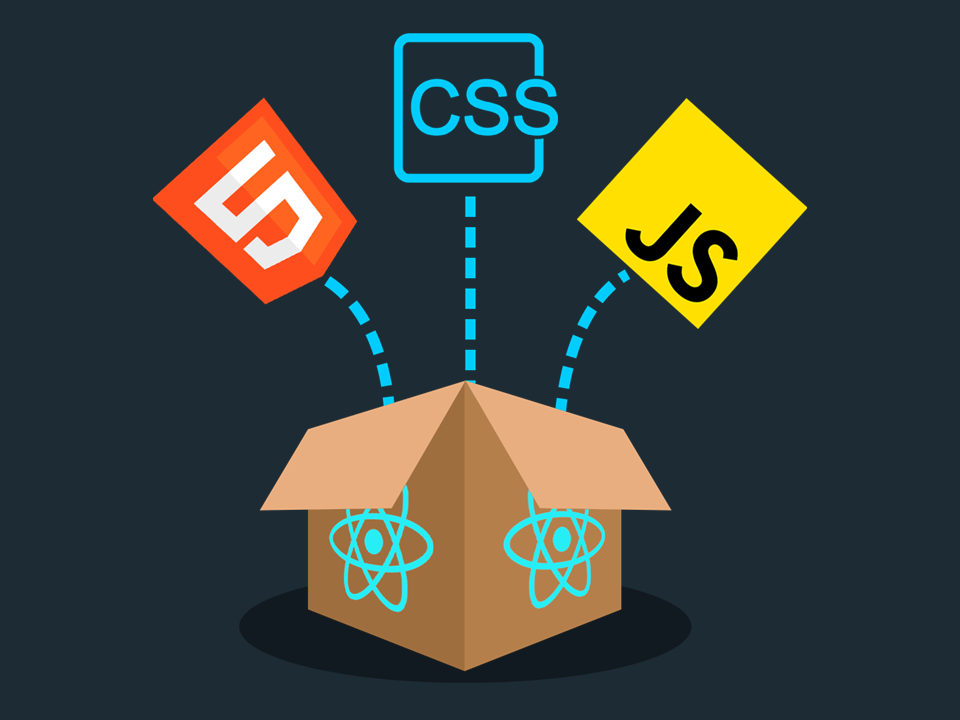

<h1 align="center">&nbsp; Hi there!&nbsp;:wave:. </h1>

<h1 align="center">My name is Ilia Vatafov and I am a passionate Junior Front-End Developer,</h1>

eager to bring my skills and enthusiasm to a dynamic and growing organization. With a strong background in HTML, CSS, JavaScript and React, I am confident in my ability to contribute to the development and design of engaging and user-friendly web applications. Whether it's creating visually appealing layouts or implementing responsive designs, I am always striving to exceed expectations and deliver exceptional results. I am eager to continue learning and growing as a developer, and am excited to see where my career will take me next. Let's create something great together!

<h1 align="center">My Technology Stack</h1>

<h1 align="center">My Work</h1>

- ### **React JS** - <a name="welovebooks" href="https://welovebooks.online/">WeLoveBooks</a>

- ### **React JS** - <a name="perfectjobs-lite" href="https://perfectjobs-lite.netlify.app/">PerfectJobs-Lite</a>

- 🌱 I'm currently enrolled in a JavaScript Back-End course at Software University, where I'm learning the fundamentals of ExpressJS, MongoDB, and Mongoose.

- ⚡ Fun fact: ...

- 📫 How to reach me: ...

<!--
**iliavatafov/iliavatafov** is a ✨ _special_ ✨ repository because its `README.md` (this file) appears on your GitHub profile.

Here are some ideas to get you started:

- 🌱 I’m currently learning ...

- 🌱 I’m currently learning ...
- 👯 I’m looking to collaborate on ...
- 🤔 I’m looking for help with ...
- 💬 Ask me about ...

- 😄 Pronouns: ...

-->
